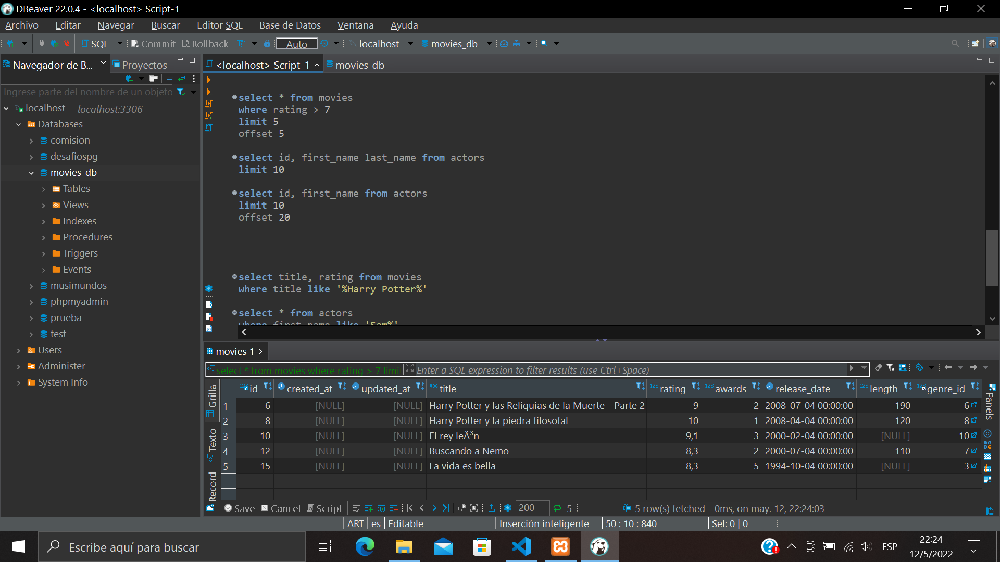

## Manipulación y consulta de datos
### En esta actividad realizamos diferentes consultas a la Base de Datos
#### Utilizamos insert, update, delete (sin olvidar el where), order by, between, like, limit, offset y alias

